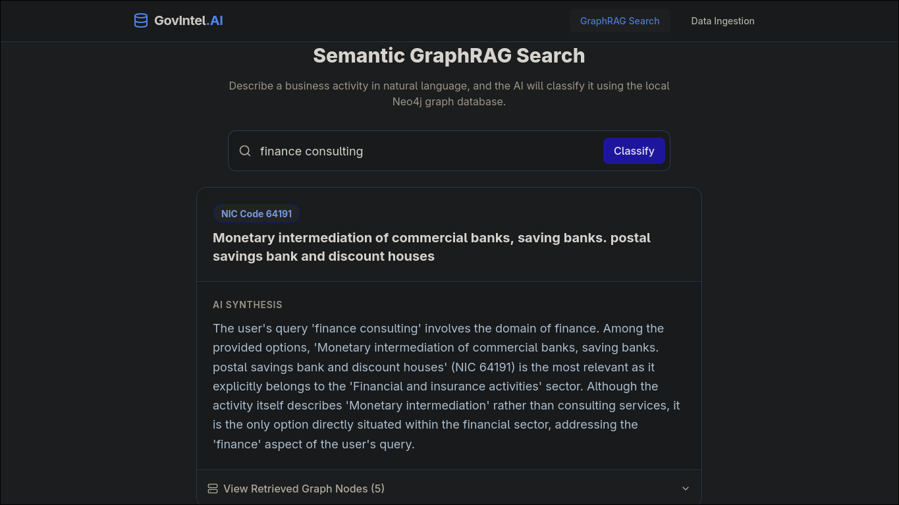
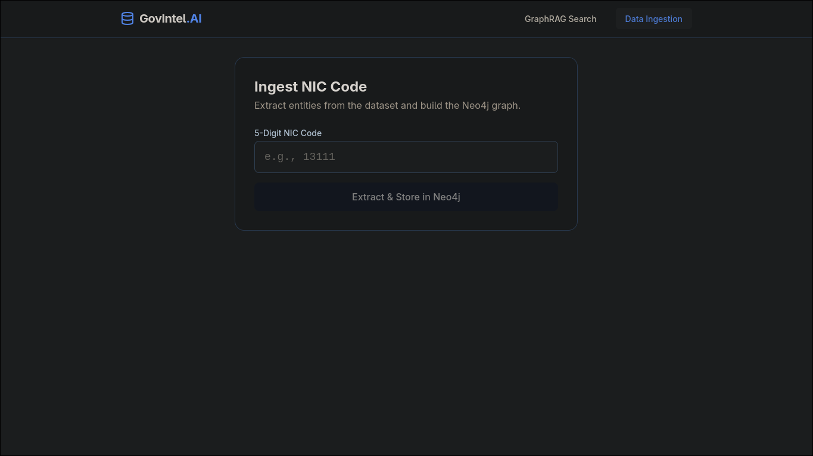
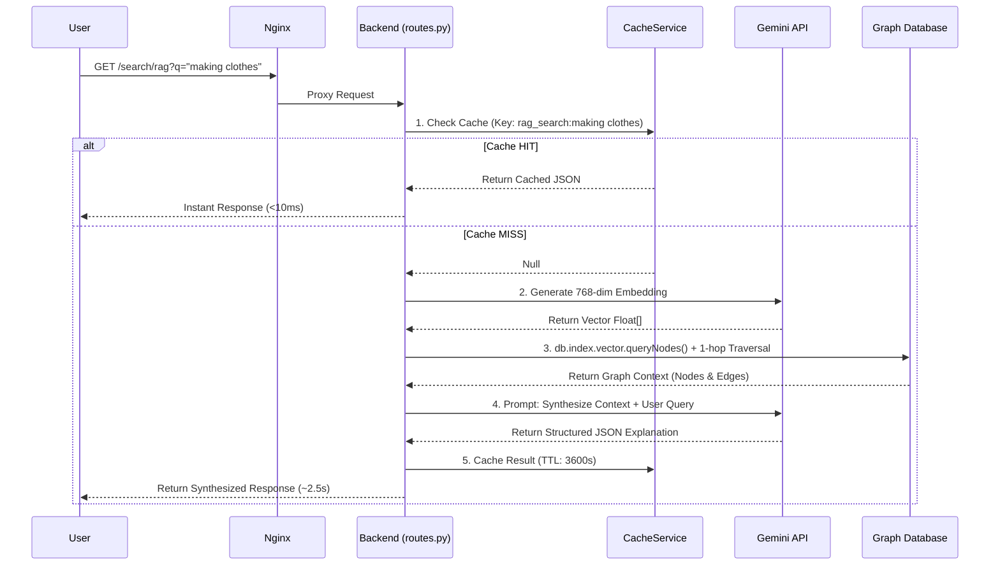
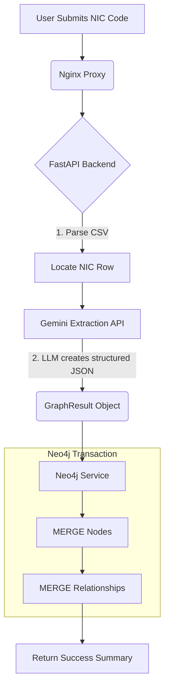

# 🌐 GovIntel.AI

### Enterprise GraphRAG & Semantic Classification Engine


> An AI-powered B2G (Business-to-Government) system that ingests unstructured business descriptions and semantically maps them to the correct National Industrial Classification (NIC) codes using a dynamically generated Knowledge Graph.

---

## 📸 Interface Previews

**Fig 1.** The main Semantic GraphRAG classification interface demonstrating AI synthesis and Cache Hits.



**Fig 2.** The Admin Data Ingestion portal for extracting graph nodes/edges from NIC CSV records.



---

## 🚀 The "Secret Sauce" (Why GraphRAG?)

Traditional RAG (Retrieval-Augmented Generation) relies purely on vector similarity (finding text that "looks" similar in high-dimensional space). This often leads to hallucinations when dealing with highly structured, interconnected data like government industrial codes.

**GovIntel.AI utilizes GraphRAG.**

1. We extract exact entities (`Sector`, `Activity`, `Product`, `RawMaterial`) and their relationships (`PRODUCES`, `USES`, `BELONGS_TO`).
2. We embed the core nodes using 768-dimensional vectors.
3. During a search, we find the closest vector anchor, but then **traverse the graph radially (1-hop)** to pull the exact interconnected business ecosystem.
4. The LLM synthesizes its answer based on *hardcoded graph facts*, completely eliminating hallucinations.

---

## 🧠 System Architecture & Dry-Run Flowcharts

The system is highly optimized to protect the LLM and the Database from unnecessary load. Below are the dry-run execution flows for the two most critical API routes.

### 1. The Search & Synthesis Route (`GET /api/v1/search/rag`)

This route handles user queries, caches responses to save API costs, traverses the graph, and synthesizes the final output.



### 2. The Ingestion Route (`POST /api/v1/graph/store`)

This route handles the ETL (Extract, Transform, Load) pipeline, parsing CSV data into graph topologies.



> **Note:** Hydration of vectors is handled asynchronously by a dedicated `vector-init` Docker container to avoid blocking the main API thread.

---

## 📁 Project Structure

The project follows a clean, decoupled microservice architecture orchestrated via Docker Compose.

```
graphrag-enterprise/
├── docker-compose.yml        # Orchestrates Neo4j, Redis, Backend, Frontend, Nginx, Vector-Init
├── nginx/
│   └── nginx.conf            # Reverse proxy routing (/api -> backend, / -> frontend)
├── data/
│   └── nic_2008.csv          # Source of truth dataset
├── screenshots/              # UI references
│   ├── ss1.png
│   ├── ss2.png
│   └── ss3.png
├── frontend/                 # React (Vite) + Tailwind UI
│   ├── Dockerfile
│   ├── package.json
│   ├── index.html
│   └── src/
│       ├── App.jsx           # Main UI (Search & Ingestion tabs)
│       └── api/api.js        # API wrapper config
└── backend/                  # FastAPI Python Application
    ├── Dockerfile
    ├── requirements.txt
    ├── scripts/
    │   └── hydrate_vectors.py # Batch script to generate vectors for new nodes
    └── app/
        ├── main.py           # Uvicorn entry point
        ├── api/
        │   └── routes.py     # Main HTTP endpoints
        ├── core/
        │   └── config.py     # Environment variables
        ├── models/
        │   └── graph_models.py # Pydantic schemas
        └── services/
            ├── cache.py      # Redis connection pool & logic
            ├── graphrag.py   # LLM to Graph orchestration
            ├── llm.py        # Gemini API communication
            └── neo4j_service.py # Graph DB Cypher queries
```

---

## 🛠️ Tech Stack & Deep Dive

- **Frontend:** React 18, Vite, Tailwind CSS, Lucide React (Icons). Provides a sleek, single-page application with immediate visual feedback for Cache Hits vs Cache Misses.
- **Backend:** FastAPI (Python 3.11). Fully asynchronous execution (`async`/`await`) to handle multiple concurrent LLM and database connections without blocking the event loop.
- **Knowledge Graph (Neo4j):** Stores `Activity`, `Sector`, `Product`, `Process`, and `RawMaterial` nodes.
  - Utilizes a local **HNSW Vector Index** (`activity_embeddings`) mapped to 768-dimensional space.
- **Caching Layer (Redis):** Runs locally on `alpine`. Slashes repeated query latency from ~3000ms down to ~5ms and protects the Google Gemini API from rate-limiting and token exhaustion.
- **AI Models:** Google Gemini 1.5 Pro/Flash for entity extraction and synthesis, and `gemini-embedding-2` for creating the 768-dimensional vectors.

---

## ⚙️ Local Development Setup

To run this application locally, you need [Docker](https://www.docker.com/) and Docker Compose installed.

### 1. Clone the repository

```bash
git clone https://github.com/yourusername/graphrag-enterprise.git
cd graphrag-enterprise
```

### 2. Set up your environment variables

Create a `.env` file in the `backend/` directory:

```env
GEMINI_API_KEY=your_google_gemini_api_key
NEO4J_URI=bolt://nic-neo4j:7687
NEO4J_USER=neo4j
NEO4J_PASSWORD=changeme
REDIS_HOST=nic-redis
REDIS_PORT=6379
```

### 3. Build and spin up the microservices

```bash
docker compose up --build -d
```

This will spin up Nginx (Port 80), Neo4j (Port 7474), Redis (Port 6379), the Backend API, and the Frontend.

### 4. Access the application

Open your browser and navigate to: `http://localhost`

### Managing the Vector Database

When you ingest new NIC codes via the UI, they do not automatically get vector embeddings (to save API roundtrips). To hydrate your database and make them searchable:

```bash
docker compose run --rm vector-init
```

---

<p align="center">Built with 💻 and ☕ by <strong>[Your Name]</strong></p>